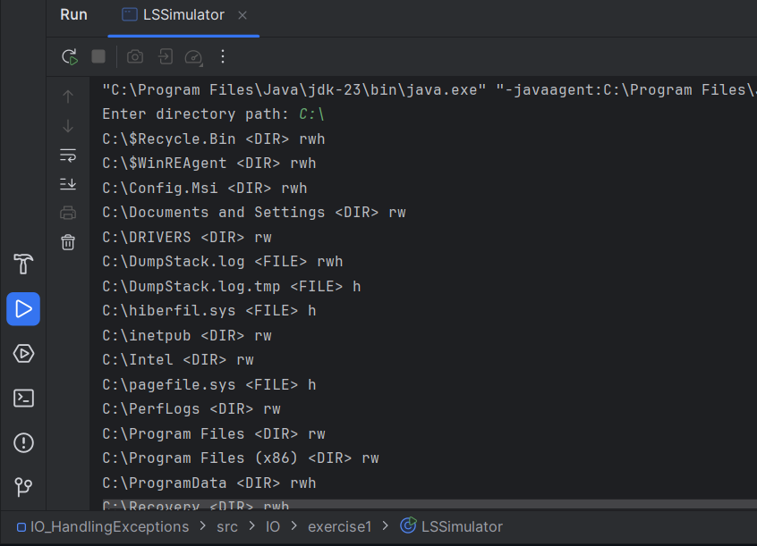
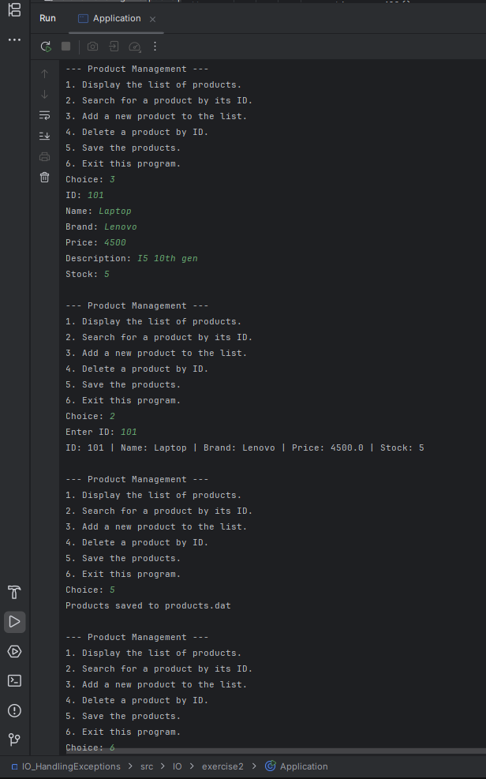
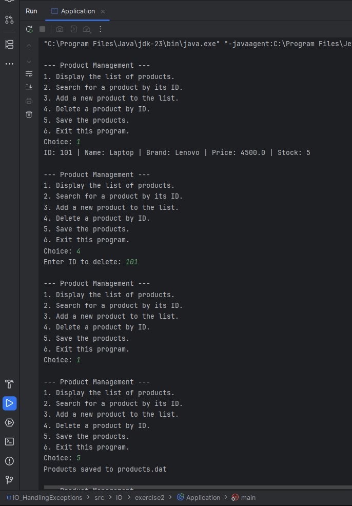
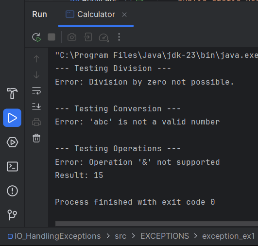
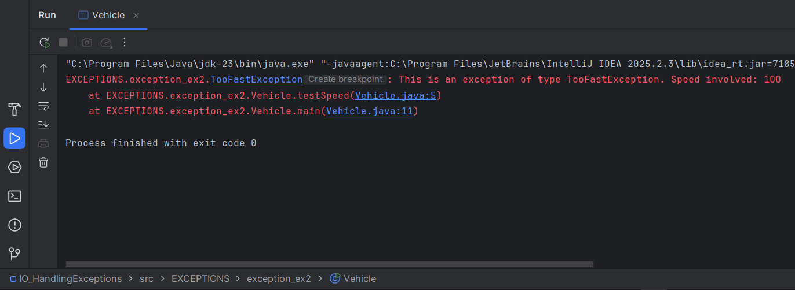

# Java Hands-on Activity: IO and Handling Exceptions

## Project Overview
This project consists of a series of Java exercises designed to reinforce fundamental concepts in Input/Output (I/O) operations, Object Serialization, and robust Exception Handling. The repository is organized into distinct packages, each addressing a specific real-world programming scenario, ranging from file system simulation to custom error management.

---

## Part 1: File System Simulation (IO.exercise1)
### Objective
To develop a Java program that simulates the "ls" command found in operating systems, focusing on reading directory contents and file attributes.

### Key Classes/Interfaces
* **LSSimulator.java**: The main class responsible for capturing user input (directory path) and iterating through the file system to display information.

### Features
* **Path Processing**: Accepts a full directory path from the user.
* **Type Identification**: Categorizes entries as either `<DIR>` (directories) or `<FILE>` (files).
* **Access Mode Detection**: Identifies and displays permitted access modes:
    * 'r' for readable files.
    * 'w' for writable files.
    * 'h' for hidden/cache files.

> 

---

## Part 2: Object Serialization and Management (IO.exercise2)
### Objective
To implement a persistent storage system using Java's Serialization mechanism to save and retrieve product-type objects from a file.

### Key Classes/Interfaces
* **Product.java**: An entity class representing a product with attributes like id, name, brand, price, description, and stock count.
* **IProduitMetier.java**: An interface defining the core business logic methods for product management.
* **MetierProduitImpl.java**: The implementation class that manages the product list and handles file I/O operations.
* **Application.java**: A console-based interface providing a menu-driven user experience.

### Features
* **Object Serialization**: The Product class implements `Serializable` to enable file-based persistence.
* **CRUD Operations**: Full support for adding, listing, searching by ID, and deleting products.
* **Data Persistence**: A `saveAll` function that writes the entire collection to `products.dat`.
* **Menu-Driven Interface**: A `while` loop implementation offering six distinct operational options.

> 

> 

---

## Part 3: Standard Exception Handling (EXCEPTIONS.exception_ex1)
### Objective
To practice handling common runtime errors using try-catch blocks to ensure application stability.

### Key Classes/Interfaces
* **Calculator.java**: Contains arithmetic and conversion logic with integrated error handling.

### Features
* **Division Safety**: Detects and handles division by zero, displaying a specific error message.
* **Input Validation**: Converts strings to numbers while catching invalid formats (e.g., non-numeric strings).
* **Operation Control**: Validates supported mathematical operations (+, -, *, /) and rejects unsupported symbols.

> 

---

## Part 4: Custom Exceptions (EXCEPTIONS.exception_ex2)
### Objective
To create and implement custom exception types to handle domain-specific logic violations.

### Key Classes/Interfaces
* **TooFastException.java**: A custom exception class inheriting from `Exception` that captures and reports specific speed values.
* **Vehicle.java**: A class that utilizes the custom exception to enforce speed limits.

### Features
* **Custom Exception Logic**: Implements a constructor that passes dynamic messages to the super-class.
* **Boundary Checking**: A `testSpeed()` method that throws the `TooFastException` if an integer value exceeds 90.
* **Stack Trace Management**: Demonstrates the use of `printStackTrace()` to debug and display the exception call stack.

> 